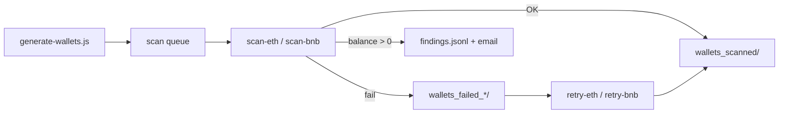
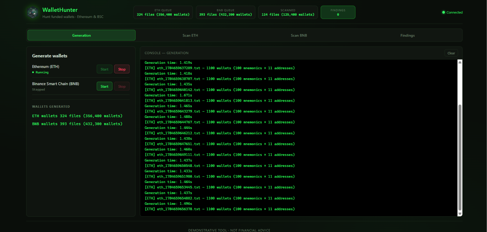
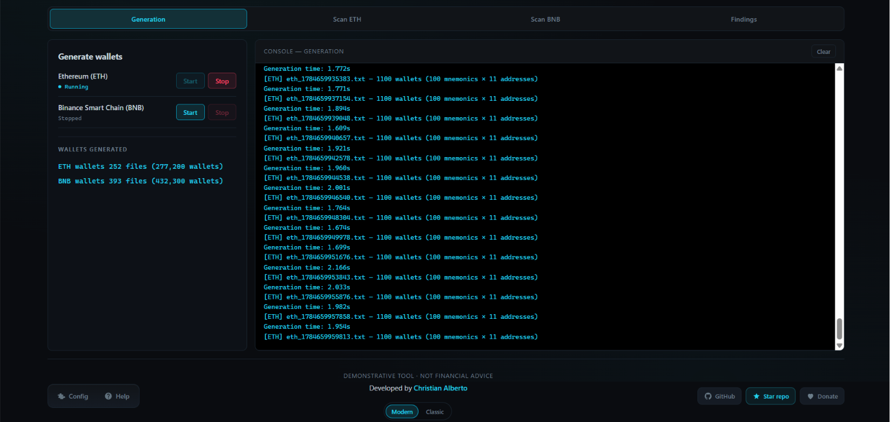
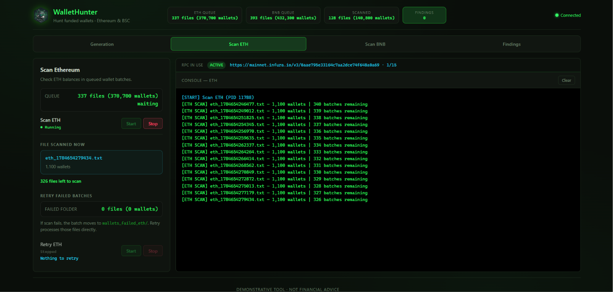
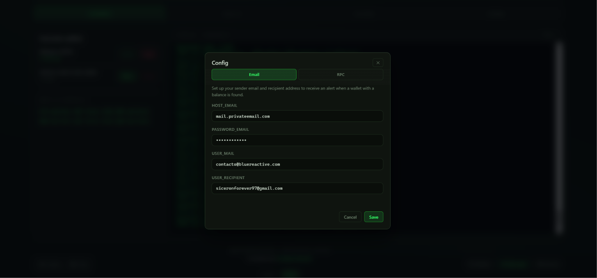
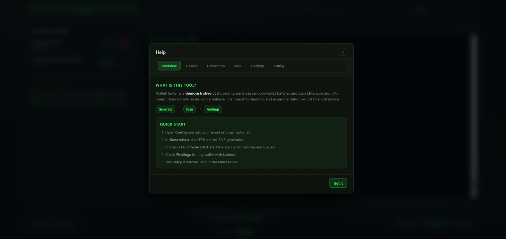

<p align="center">
  
</p>

<p align="center">
  <pre style="display:inline-block;text-align:left;font-family:monospace;font-size:11px;line-height:1.15;margin:0;">
__        __    _ _      _   _   _             _
\ \      / /_ _| | | ___| |_| | | |_   _ _ __ | |_ ___ _ __
 \ \ /\ / / _` | | |/ _ \ __| |_| | | | | '_ \| __/ _ \ '__|
  \ V  V / (_| | | |  __/ |_|  _  | |_| | | | | ||  __/ |
   \_/\_/ \__,_|_|_|\___|\__|_| |_|\__,_|_| |_|\__\___|_|
  </pre>
</p>

<p align="center"><em>Hunt funded wallets · Ethereum &amp; BSC</em></p>

**Demonstrative** Node.js tool to generate random Ethereum/BSC wallet batches, scan on-chain balances in bulk via a smart contract, and alert by email when a funded address is found.

> **Important:** This project is for learning and experimentation — not financial advice. The probability of finding a funded random wallet is negligible.

<p align="center">
  <a href="LICENSE"></a>
  <a href="https://nodejs.org/"></a>
  <a href="https://developer.mozilla.org/en-US/docs/Web/JavaScript"></a>
  <a href="smart_contract/WalletBalanceChecker.sol"></a>
  <a href="https://web3js.org/"></a>
  <a href="https://expressjs.com/"></a>
  <a href="https://ethereum.org/"></a>
  <a href="https://www.bnbchain.org/"></a>
</p>

---

## What this project really is

WalletHunter has two ways to run, but **one core**:

| Layer | Role |
|-------|------|
| **Node scripts** (`server/*.js`) | **Core business logic** — generation, scanning, retry, email, RPC rotation, findings |
| **Web dashboard** (`npm run dashboard`) | **Optional control panel** — starts/stops the same scripts, shows live logs and stats |

You can use the tool **without ever opening the browser**: run the scripts from the terminal, watch folders and log files, and everything works the same. The dashboard is convenience, not the engine.

Both modes share the same folders, the same `.env`, the same `rpc-config.json`, and the same output files.

---

## Core pipeline



**Stages:**

1. **Generate** — Create `.txt` batch files (1,100 wallets each) into the network scan queue.
2. **Scan** — Read batches from the queue, call `WalletBalanceChecker.checkBalances()` on-chain, rotate RPCs on failure.
3. **Alert** — Append funded wallets to `findings.jsonl` and send SMTP email (if configured).
4. **Archive** — Move successful batches to `wallets_scanned/`.
5. **Retry** — Re-process batches that failed during scan from `wallets_failed_eth/` or `wallets_failed_bnb/`.

ETH and BNB run **in parallel** as separate queues and scripts. Scanned batches from both networks share one archive folder.

---

## Folders & logs

| Term / path | Purpose |
|-------------|---------|
| **Batch / file** | One `.txt` with 1,100 wallets (`100` mnemonics × `11` derived addresses). |
| `server/wallets_scan_eth/` · `server/wallets_scan_bnb/` | Scan queues — batches waiting to be scanned. |
| `server/wallets_failed_eth/` · `server/wallets_failed_bnb/` | Batches that failed during scan (RPC, contract, I/O, etc.). |
| `server/wallets_scanned/` | Successfully processed batches (ETH + BNB share this folder). |
| `server/log/findings.jsonl` | Funded wallets (balance > 0). |
| `server/log/scan-progress.json` | Current file being scanned (dashboard + API). |
| `server/log/rpc-status.json` | Active RPC endpoint per network. |
| `server/log/error/` | Detailed error logs. |
| **RPC rotation** | On RPC failure, the scan engine tries the next URL in your list automatically. |
| **Job** | A running script instance. The dashboard spawns child processes; CLI runs directly in your terminal. |

**CLI monitoring:** count files in the scan queues, read the log files above, or watch stdout in each terminal.

All wallet `.txt` files and logs are **gitignored** — never commit them.

---

## Requirements

- **Node.js 18+**
- **SMTP account** (optional — only needed for email alerts)
- **Your own RPC endpoints** (recommended for production use; public defaults ship with the repo)

---

## Installation

```bash
git clone https://github.com/christianalberto/wallethunter.git
cd wallethunter
npm install
```

---

## Configuration

### Email (`.env`)

Copy the template and fill in your SMTP settings:

```bash
cp .env.example .env
```

```env
HOST_EMAIL=smtp.example.com
PASSWORD_EMAIL=your_smtp_password
USER_MAIL=sender@example.com
USER_RECIPIENT=alerts@example.com
PORT=3001
```

| Variable | Purpose |
|----------|---------|
| `HOST_EMAIL` | SMTP server hostname |
| `PASSWORD_EMAIL` | SMTP password |
| `USER_MAIL` | Sender address |
| `USER_RECIPIENT` | Where balance alerts are sent |
| `PORT` | Dashboard HTTP port (default `3001`) |

**Do not commit `.env`.** The dashboard can edit email settings via **Config → Email**; values are written to `.env` on save.

### RPC endpoints (`rpc-config.json`)

Scan scripts need JSON-RPC URLs. **Use your own keys — do not rely on someone else's private endpoints.**

| File | In Git? | Purpose |
|------|---------|---------|
| `server/config/rpc-defaults.json` | Yes | Public RPC list used when no local config exists |
| `rpc-config.example.json` | Yes | Template showing the expected JSON shape |
| `rpc-config.json` | **No** (`.gitignore`) | **Your private RPC lists** |

Create your local file:

```bash
cp rpc-config.example.json rpc-config.json
```

Edit `rpc-config.json`:

```json
{
  "eth": [
    "https://mainnet.infura.io/v3/YOUR_PROJECT_ID",
    "https://eth.llamarpc.com"
  ],
  "bnb": [
    "https://bsc-dataseed.bnbchain.org",
    "https://bsc-dataseed.nariox.org"
  ]
}
```

URLs are tried **in order** with automatic failover. You can also edit lists from the dashboard: **Config → RPC** (one URL per line).

If `rpc-config.json` is missing, the app falls back to `rpc-defaults.json` (public endpoints only).

---

## Quick start (CLI)

Primary way to run WalletHunter. Each `npm run` maps to a script under `server/` — direct equivalent: `node server/<script>.js`.

```bash
# Generation — runs until Ctrl+C
npm run generate:eth
npm run generate:bnb

# Scan queues
npm run scan:eth
npm run scan:bnb

# Retry failed batches (when files land in wallets_failed_*)
npm run retry:eth
npm run retry:bnb
```

**Typical flow** (use separate terminals, or run steps sequentially):

- **Terminal 1** — `npm run generate:eth` fills `wallets_scan_eth/`.
- **Terminal 2** — `npm run scan:eth` once batches exist.
- **Optional** — same pattern for BNB (`generate:bnb` + `scan:bnb`).
- **On scan errors** — `npm run retry:eth` / `retry:bnb` re-processes `wallets_failed_*`.

Scan and retry share the same engine (`server/lib/scan-runner.js`); retry reads from the failed folder instead of the queue.

---

## Web dashboard — optional UI

The dashboard **does not replace** the scripts. It **spawns and monitors** the same CLI jobs via `server/lib/process-manager.js` and streams stdout over WebSocket.

```bash
npm run dashboard
```

Open [http://localhost:3001](http://localhost:3001) (or your `PORT`). Tabs mirror the CLI workflow: generation, scan (ETH/BNB), and findings.

**Footer controls:**

- **Config → Email** — edit `.env` alert settings
- **Config → RPC** — edit `rpc-config.json`
- **Help** — in-app documentation
- **Modern / Classic** — UI theme

The dashboard exposes REST (`/api/*`) and WebSocket for live console lines, job status, and queue counters. You can run CLI jobs and dashboard jobs **at the same time** — they operate on the same folders (avoid starting duplicate scan jobs on the same network).

---

## Wallet batch format

Each line in a `.txt` batch file:

```
0xPublicAddress|privateKeyHex
```

File naming: `eth_{timestamp}.txt` or `bnb_{timestamp}.txt`.

Each file contains **1,100 wallets** (100 BIP39 mnemonics, 11 addresses per mnemonic, derivation path `m/44'/60'/0'/0/{index}`).

---

## On-chain scanning

Scan scripts call a deployed **`WalletBalanceChecker`** contract that reads native balances in batch:

| Network | Contract |
|---------|----------|
| Ethereum | `0xA9bE94B2F5C9717bF004aEc140F4f1e3CA916f7a` |
| BSC | `0xfcf6f4cef541727f6026ff2e60b44c141c9758d0` |

Source: `smart_contract/WalletBalanceChecker.sol`

When `balance > 0`, the script records the finding and sends email (if SMTP is configured).

---

## Project structure

```
wallet-hunter/
├── .env.example                 # SMTP + PORT template
├── rpc-config.example.json      # RPC template (copy → rpc-config.json)
├── package.json                 # npm scripts
├── public/                      # Dashboard static UI
│   ├── index.html
│   ├── app.js
│   └── styles.css
├── server/
│   ├── config/
│   │   ├── config.js            # Loads .env
│   │   └── rpc-defaults.json    # Public RPC fallback (committed)
│   ├── generate-wallets.js      # ★ Generate
│   ├── scan-eth.js              # ★ Scan ETH
│   ├── scan-bnb.js              # ★ Scan BNB
│   ├── retry-eth.js             # ★ Retry ETH
│   ├── retry-bnb.js             # ★ Retry BNB
│   ├── web-server.js            # Dashboard HTTP + WebSocket
│   ├── paths.js                 # Directory paths
│   ├── constants.js             # Wallets per file (1100)
│   └── lib/
│       ├── scan-runner.js       # ★ Shared scan/retry engine
│       ├── rpc.js               # RPC rotation
│       ├── rpc-config.js        # Read/write rpc-config.json
│       ├── env-config.js        # Read/write .env from dashboard
│       ├── findings.js          # findings.jsonl
│       ├── process-manager.js   # Spawns CLI jobs for dashboard
│       ├── scan-progress.js     # Progress file for UI
│       └── retry-stats.js       # Failed-folder stats
└── smart_contract/
    └── WalletBalanceChecker.sol
```

★ = core business logic

---

## Dependencies

| Package | Use |
|---------|-----|
| `web3` | RPC + smart contract calls |
| `ethereumjs-wallet` | HD wallet derivation |
| `bip39` | Mnemonic generation |
| `nodemailer` | Email alerts |
| `dotenv` | `.env` loading |
| `express` | Dashboard HTTP API |
| `ws` | Live console WebSocket |

---

## Security

- `.txt` wallet files contain **private keys** — treat as secrets.
- Never commit `.env`, `rpc-config.json`, wallet batches, or findings.
- Configure **your own** RPC URLs with **your own** API keys.
- If this repo was ever pushed with private RPC keys in source history, rotate those keys.
- Verify on-chain contract addresses before use.

---

## Screens

Dashboard previews from the web UI (`npm run dashboard`).

### Generation

<p align="center">
  
</p>

<p align="center"><em>Classic theme — wallet generation with live console output.</em></p>

<p align="center">
  
</p>

<p align="center"><em>Modern theme — generation controls, stats, and footer links.</em></p>

### Scan ETH

<p align="center">
  
</p>

<p align="center"><em>Scan ETH — active RPC endpoint, current batch, and scan console.</em></p>

### Config &amp; Help

<p align="center">
  
</p>

<p align="center"><em>Config modal — email alerts (SMTP sender and recipient).</em></p>

<p align="center">
  
</p>

<p align="center"><em>Help modal — overview and quick start guide.</em></p>

---

## Author

**Christian Alberto** — [github.com/christianalberto](https://github.com/christianalberto)

- Repository: [github.com/christianalberto/wallethunter](https://github.com/christianalberto/wallethunter)
- Sponsors: [github.com/sponsors/christianalberto](https://github.com/sponsors/christianalberto)

If this project helped you, a star on GitHub repo is appreciated.

---

<p align="center">
  <em>Open-source &amp; free to use. If WalletHunter helped you learn, a star or sponsor keeps the project going ❤️</em>
</p>

<p align="center">
  <a href="https://github.com/sponsors/christianalberto">
    
  </a>
</p>

---

## License

MIT — see [LICENSE](LICENSE).
